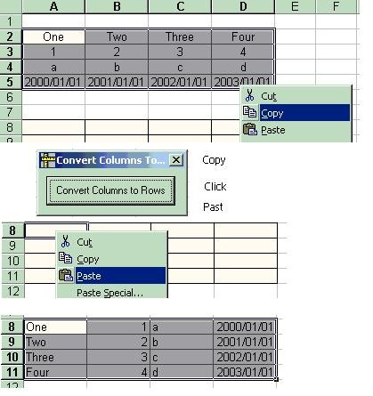



## Convert Columns To Rows

### Description

Convert Columns To Rows for Excel. Select Cells and copy to clipboard. Click then past back to excel.
 
### More Info
 

             |
---                |---
**Submitted On**   |2002-05-03 09:23:14
**By**             |[Tony Albutt](https://github.com/Planet-Source-Code/PSCIndex/blob/master/ByAuthor/tony-albutt.md)
**Level**          |Beginner
**User Rating**    |5.0 (10 globes from 2 users)
**Compatibility**  |VB 5\.0, VB 6\.0
**Category**       |[String Manipulation](https://github.com/Planet-Source-Code/PSCIndex/blob/master/ByCategory/string-manipulation__1-5.md)
**World**          |[Visual Basic](https://github.com/Planet-Source-Code/PSCIndex/blob/master/ByWorld/visual-basic.md)
**Archive File**   |[Convert\_Co78802532002\.zip](https://github.com/Planet-Source-Code/tony-albutt-convert-columns-to-rows__1-34392/archive/master.zip)

